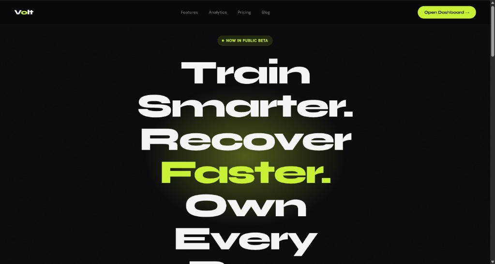
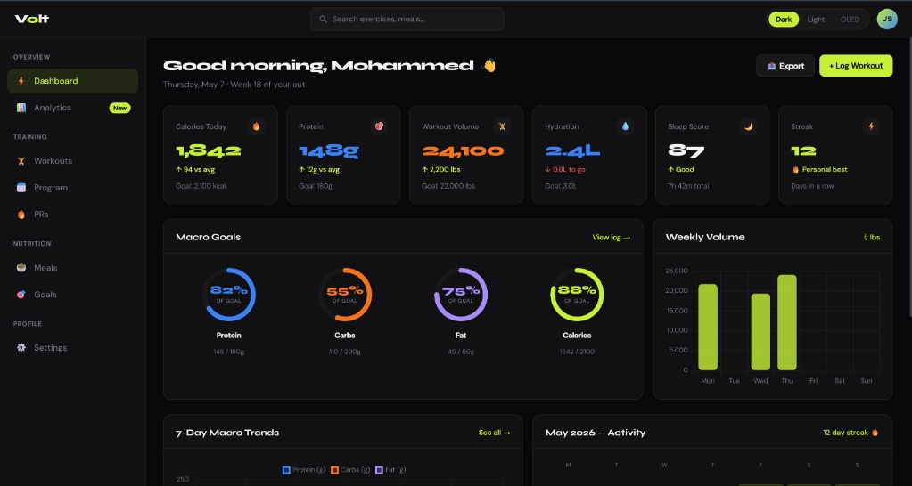
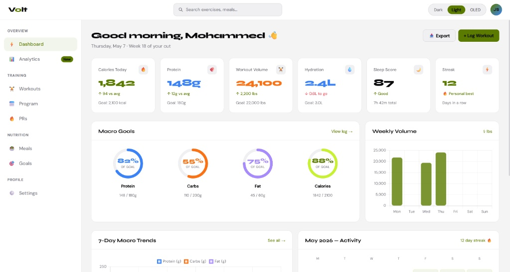

# ⚡ Volt — Fitness Analytics Interface

A high-fidelity, static front-end concept for a modern fitness analytics dashboard. Built with pure HTML and CSS — no frameworks, no dependencies, no build step.

> Inspired by the design language of Apple Health and high-end automotive interfaces. Think data-dense but never cluttered.



---

## 📌 About the Project

Volt is a proof-of-concept UI for a fitness tracking app. The goal was to explore what a premium, data-forward fitness interface could look like — using only vanilla HTML and CSS, before migrating the architecture to React.

This is **Page 1 of 2** in a two-page portfolio project:

| Page | File | Description |
|---|---|---|
| Landing | `index.html` | Marketing page — hero, features, theme previews, CTA |
| Dashboard | `dashboard.html` | Analytics page — stat tiles, macro rings, charts, streak calendar |

---

## 🖼️ Screenshots

### Landing Page


### Dashboard — Dark Theme


### Dashboard — Light Theme


---

## ✨ Features

- **3-Mode Theme Toggle** — Dark, Light, and OLED Black, implemented with vanilla JavaScript and CSS custom properties. One `data-theme` attribute on the root element switches every color on the page simultaneously.
- **Circular Macro Rings** — SVG-based progress rings for Protein, Carbs, Fat, and Calories. Stroke-dashoffset calculated per ring.
- **Interactive Charts** — Weekly macro trends (line) and workout volume (bar) powered by [Chart.js](https://www.chartjs.org/).
- **Responsive Activity Grid** — Six stat tiles laid out with `CSS Grid` and `auto-fit` + `minmax()`. Reflows from 6 columns on desktop to 2 on mobile with zero media queries.
- **Streak Calendar** — Monthly activity grid showing workout days, rest days, and missed days with color coding.
- **App Shell Layout** — Fixed topbar + sidebar + scrollable main area using CSS Grid named template areas.

---

## 🎨 Design Decisions

**Typography** — [Syne](https://fonts.google.com/specimen/Syne) for headings (high personality, strong weight contrast) and [DM Sans](https://fonts.google.com/specimen/DM+Sans) for body text (neutral, readable at small sizes).

**Color** — A single brand accent (`#c8f135`, volt yellow-green) on a near-black base. High contrast without being harsh. The accent color shifts across themes — in Light mode it darkens to `#5a7a00` to maintain readability on white.

**Spacing** — Consistent 14px gap system throughout the grid. Cards use `border-radius: 14px` universally. No shadows — borders do the separation work instead.

---

## 🗂️ Project Structure

```
volt/
├── index.html        ← Landing page
├── dashboard.html    ← Analytics dashboard
└── assets/
    ├── volt_landing.jpeg
    ├── volt_dash_dark.jpeg
    └── volt_dash_light.jpeg
```

---

## 🚀 Running Locally

No install. No build step. Just open the files.

```bash
# Clone the repo
git clone https://github.com/M-AlAteegi/volt.git

# Open in browser
# Double-click index.html
# Or use VS Code Live Server extension for hot reload
```

---

## 🔭 What's Next — React Migration

This project is being migrated to React to demonstrate the same UI built with a component architecture. The React version introduces:

- `useState` for the theme toggle instead of `setAttribute`
- Reusable components — `<StatTile />`, `<MacroRing />`, `<WorkoutRow />`
- Data arrays driving the UI instead of hardcoded HTML
- `react-chartjs-2` handling the Chart.js lifecycle automatically
- CSS Grid layout unchanged — the CSS file ports over with zero modifications

---

## 🛠️ Built With

- HTML5
- CSS3 (Custom Properties, Grid, Flexbox)
- Vanilla JavaScript (theme toggle, Chart.js init)
- [Chart.js 4.4](https://www.chartjs.org/) via CDN
- [Google Fonts](https://fonts.google.com/) — Syne + DM Sans

---

## 👤 Author

**Mohammed Al-Ateegi**
GitHub: [@M-AlAteegi](https://github.com/M-AlAteegi)

---

## 📄 License

This project is open source and available under the [MIT License](https://opensource.org/licenses/MIT).
